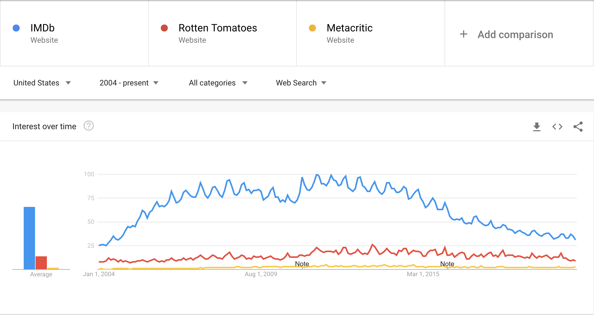

```{r, echo=FALSE}
library(ggplot2)
library(stringr)
```

## Introduction

In recent years, a trend has emerged in film marketing, particularly in how films are advertised on television, which emphasizes a film's performance on the popular review aggregator site Rotten Tomatoes, in order to promote a film's quality hopefully attracting more theatrical viewers. Though Rotten Tomatoes has gained widespread popularity as a source for movie reviews among audiences, this usage begs the question as to whether this type of advertising is actually warranted. Furthermore, given the slew of other viable review aggregator sites, such as IMDB and Metacritic, it also seems worth understanding whether or not any of these competing sites could serve as a more successful motivator for driving audiences to theaters. In this analysis, I will explore both of these questions, not as a means to predict the financial success of a film based on its reviews, but as an exploratory means to identify which types of reviews offer the most success to studios and viewers alike.

<iframe width="424" height="252" src="https://youtube.com/embed/0eMJE12xS6Y" frameborder="0" allowfullscreen></iframe>
<iframe width="424" height="252" src="https://youtube.com/embed/r1pn9tD8u74" frameborder="0" allowfullscreen></iframe>


## Data
The data used in this analysis has been scraped from Box Office Mojo for variables specifically relating to the film's attributes (such as any variables corresponding to genre, rating, or monetary values) while all ratings data have been sourced from their aggregator websites. Films were only included in the dataset if they had a wide release (600 theaters or more) and if this release took place on or after January 1st, 2000. In total, 3200 films were included. All monetary values have been adjusted to the 2020 US dollar and Total Gross serves the place of Domestic Gross as the motivation for this analysis mainly concerned marketing tactics within the U.S.

```{r, echo=FALSE}
#Load Wide Releases Data Set
wr <- read.csv("WideReleaseData_inflation.csv", header = TRUE)[,-1] 
#Create Return on Investment (ROI) Columns
wr$ROI <- wr$Total.Gross - wr$Budget
```

```{r, echo=FALSE}
head(wr)
```


## Analaysis 

As a preliminary exploration of our data, we use a localized regression on the ratings variables for each individual film and their total domestic gross in order to better understand the relationship between each review aggregator site and a film's success at the box office. We would expect an aggregator site with a stronger relationship to box office returns to have a higher average total gross for positive reviews and lower total gross for negative reviews when compared to similar reviews in other rating systems. 

```{r, echo=FALSE, warning=FALSE, message=FALSE, fig.align = 'center'}
rt_crit <- wr$rt_critic_score-1.96*sd(wr$rt_critic_score,na.rm = T)/sqrt(wr$rt_critic_num)
rt_aud <- wr$rt_audience_score-1.96*sd(wr$rt_audience_score,na.rm = T)/sqrt(wr$rt_audience_num)
imdb <- (wr$imdb_score-1.96*sd(wr$imdb_score,na.rm = T)/sqrt(wr$imdb_reviews))*10
mc_crit <- (wr$mc_critic_score-1.96*sd(wr$mc_critic_score,na.rm = T)/sqrt(wr$mc_critic_score))
mc_aud <- (wr$mc_audience_score-1.96*sd(wr$mc_audience_score,na.rm = T)/sqrt(wr$mc_audience_score))*10

rt_crit <- (rt_crit-min(rt_crit,na.rm = T))*100/(max(rt_crit,na.rm = T)-min(rt_crit,na.rm = T))
rt_aud <- (rt_aud-min(rt_aud,na.rm = T))*100/(max(rt_aud,na.rm = T)-min(rt_aud,na.rm = T))
imdb <- (imdb-min(imdb,na.rm = T))*100/(max(imdb,na.rm = T)-min(imdb,na.rm = T))
mc_crit <- (mc_crit-min(mc_crit,na.rm = T))*100/(max(mc_crit,na.rm = T)-min(mc_crit,na.rm = T))
mc_aud <- (mc_aud-min(mc_aud,na.rm = T))*100/(max(mc_aud,na.rm = T)-min(mc_aud,na.rm = T))

ggplot(wr) + 
  ggtitle("Domestic Box Office vs Review Aggregator Rating")+
  ylab("Total Gross (In USD)") +
  geom_smooth(method = 'loess', aes(x = mc_crit, y = Total.Gross, colour="MC Critic"),se=F)+ 
  geom_smooth(method = 'loess', aes(x = mc_aud, y = Total.Gross, colour="MC Audience"),se=F) +
  geom_smooth(method = 'loess', aes(x = rt_crit, y = Total.Gross, colour="RT Critic"),se=F) +
  geom_smooth(method = 'loess', aes(x = rt_aud, y = Total.Gross, colour="RT Audience"),se=F) +
  geom_smooth(method = 'loess', aes(x = imdb, y = Total.Gross, colour= "IMDB"),se=F) + 
  scale_colour_manual(name="Rating System", values=c("MC Critic"='blue', "MC Audience"='navy',"RT Critic"='red', "RT Audience"='maroon', "IMDB"='darkgreen'))+
  xlab("Score") 

```
<center> <font size="2"> <p style="color:grey">*Reviews adjusted to account for the total number of reviews as well as differences in scale. </p> </font> </center> \n


As expected, all review aggregators maintain a positive relationship with total gross to some extent, i.e. as the score of each aggregator increases so too does its average total gross. However, of all review aggregators, Rotten Tomatoes demonstrates the strongest relationship with total gross in both audience and critics metrics as it demonstrates the strongest rates of increase and decrease at both extremes of possible reviews. Interestingly, though IMDB possesses no particularly extreme decrease in total gross for negatively reviewed films, positively rated films are correlated with the highest increase in total gross in relation to all other rating systems. As Metacritic reviews appear to be the least affected by changes to varying score values, the remainder of this analysis will focus primarily on Rotten Tomatoes and IMDB.

As we can see from the graph above, even small increases in a film's score on Rotten Tomatoes can lead to large increases in its domestic gross, increasing exponentitally after the 75% range, or after a film is determined to be "Certified Fresh." Therefore, it would seem appropriate that, when marketing films, trailers should include a films Rotten Tomatoes Critic score if it earns this ranking. Interestingly, high IMDB and Rotten Tomatoes Audience scores appear to lead to a higher total gross than the Rotten Tomatoes Crtitic score, raising the question as to whether or not one of these competing systems may be more beneficial to a film's financial success.


<center>**Domestic Box Office Summary of Top Rated Films**</center>
```{r, echo=FALSE}
topimdb <- wr[order(imdb,decreasing = T)[1:300],]
toprtaudience <- wr[order(rt_aud,decreasing = T)[1:300],]
toprtcritic <- wr[order(rt_crit,decreasing = T)[1:300],]

topsummary <- as.data.frame(
  matrix(c(summary(topimdb$Total.Gross,na.rm = T),
         summary(toprtaudience$Total.Gross,na.rm = T),
         summary(toprtcritic$Total.Gross,na.rm = T)), nrow = 3, byrow = T)
)

colnames(topsummary) <- c("Min", "1st Qu", "Median", "Mean", "3rd Qu", "Max") 
rownames(topsummary) <- c("Top IMDB Films", "Top RT Audience Films", "Top RT Critic Films")

topsummary
```

When we compare the summary statistics for the Domestic Box Office Gross pertainigng to the 300 top rated films (the top 10%) for each review aggregator site , we can see that consisently, films with higher IMDB scores gross more money than films with high Rotten Tomatoes scores, either by audiences or by critics. Across all aspects we see the top IMDB films typically gross the most money, followed by the top Rotten Tomatoes Audience Films and lastly the Top Critic Films, each differing by about $10,000,000. Thus, it would appear that a highly rated film on IMDB, and even highly rated by Rotten Tomatoes Audiences, is more valuable than a critically successful film.


Conversely, if we look at the top 10% of films ordered by their Total Gross, we can see a slighlty different relationship.


```{r, fig.align='center', echo=FALSE}

wr$imdb <- imdb
wr$rt_aud <- rt_aud
wr$rt_crit <- rt_crit

percentiles <- t(data.frame(quantile(wr$rt_aud, na.rm = T, .75),
quantile(wr$rt_crit, na.rm = T, .75),
quantile(wr$imdb, na.rm = T , .75)))

top300 <- wr[order(wr$Total.Gross,decreasing = T)[1:300],]

percentile75 <- data.frame(site = c("IMDB","RT Audience", "RT Critic"), 
                           score = c(imdb = sum(as.numeric(top300$imdb>=percentiles[1,]),na.rm = T),
                                     rt_aud = sum(as.numeric(top300$rt_aud>=percentiles[2,]),na.rm = T),
                                     rt_crit = sum(as.numeric(top300$rt_crit>=percentiles[3,]),na.rm = T)
                                     )
                           )

ggplot(data=percentile75, aes(x=score/300, y=site)) +
  ggtitle("Top Grossing Films in the 75th Percentile of Review Aggregator Ratings")+
  xlab("Percent of Films") +
  ylab("Review Aggregator") +
  geom_bar(stat="identity",fill="steelblue")
      
```
Of the 300 top grossing movies from the past 20 years, the majority of these films have garnered reviews establishing them within the top 75th percentile of Rotten Tomatoes Critic reviews and IMDB reviews. Though highly rated Rotten Tomatoes Critic Films and Audience Films have switched positions, IMDB ratings still appear to be the most important indicator of success. In tandem with the previous table, it would seem that not only do highly rated IMDB films tend to be more successful than their counterparts, but they also seem to be some of the most successful films in general.

There could be a variety of possible factors as to why IMDB is correlated with higher increases in domestic gross for highly rated movies. One potential reason involves how the films are scored on IMDB vs Rotten Tomatoes. While IMDB utilizes are normal star system that calculates a movie's total rating using a weighted average of all reviews, Rotten Tomatoes converts star ratings submitted by both audiences and critics to a single binary value of a like or dislike which it then uses to calculate a total percentage of users who liked the film. So, for example, two films on IMDB were to have an average rating of 6 and 9, they could potentially obtain the same score on Rotten Tomatoes if they had the same proportion of reviewds that were a 6 or higher. Since IMDB can then be seen as a more accurate measurement of the quality of a film, it would make sense that high quality films would have the highest gross.

Another possible reason as to why IMDB serves as a better indicator of a film's success could be the number of users IMDB has over Rotten Tomatoes.

```{r, echo=FALSE,warning=FALSE,message=FALSE, fig.align='center'}
ggplot(wr[wr$rt_audience_num<20000000,]) + 
  geom_smooth(method = 'loess', aes(x = mc_audience_score*10, y =mc_audience_num, colour="MC Audience"),se=F) +
  geom_smooth(method = 'loess', aes(x = rt_audience_score, y = rt_audience_num, colour="RT Audience"),se=F) +
  geom_smooth(method = 'loess', aes(x = imdb_score*10, y = imdb_reviews, colour= "IMDB"),se=F) + 
  scale_colour_manual(name="Rating System", values=c("MC Audience"='navy', "RT Audience"='maroon', "IMDB"='darkgreen'))+
  xlab("Score")+ 
  ylab("Number of Reviews")+
  ggtitle("Number of Reviews and Movie Rating")
```
<center> <font size="2"> <p style="color:grey">*38 films omitted from  calculation as they maintained an abnormally high number of Rotten Tomatoes reviews.</p> </font> </center> \n


Looking at the relationship between a film's score and the number of reviews it obtains on each aggregator site, we can see that a highly rated film on IMDB will obtain significantly more reviews than either Rotten Tomatoes or Metacritic after the film surpasses the 75% range. Interestingly, this benchmark also corresponds to the point on our graph of Total Gross and Aggregator Score where IMDB films become more successful than Rotten Tomatoes, supporting the notion that there exists some relatiopnship between the number of reviews IMDB receives and its relationship with a film's success.

Not only does the number of reviewers appear to have some bearing between IMDB and its higher increase in Total Gross, but also its number of users. According data pertaining to the number of times IMDB was googled compared to Rotten Tomatoes, we see that IMDB has nearly 5x as much traffic. While this can be partially attributed to the larger number of features on IMDB, such as trivia about a particular film, it is likely that IMDB is a more popular destination for reviews as well. According to Wikipedia, IMDB started 10 years prior to Rotten Tomatoes so it would not be unreasonable to assume IMDB has ammassed a much larger user base in this time.


<center> <font size="2"> <p style="color:grey">Sourced from Google Trends</p> </font> </center> \n


## Conclusion

Including a film's Rotten Tomatoes score into marketing appears to be a viable way to increase a film's visibility and ultimate box office revenue. Althoughm as IMDB has a much wider user base and is correlated with higher increases in domestic gross over all other review aggregator sites, it would appear that a film could significantly benefit from including this score in marketing if it were sufficiently high. 

```{r, echo=FALSE,warning=FALSE,message=FALSE, fig.align='center'}
ggplot(wr) + 
  geom_smooth(method = 'loess', aes(x = rt_crit, y = Total.Gross, colour="RT Critic")) +
  geom_smooth(method = 'loess', aes(x = rt_aud, y = Total.Gross, colour="RT Audience")) +
  geom_smooth(method = 'loess', aes(x = imdb, y = Total.Gross, colour= "IMDB")) + 
  geom_vline(aes(xintercept=75),linetype="dashed")+
  scale_colour_manual(name="legend", values=c("RT Critic"='red', "RT Audience"='maroon', "IMDB"='darkgreen'))+
  xlab("Score") 
```

From a plot of comparing the total grosses of individual films against their aggregator score, we see the adjusted value where IMDB overtakes Rotten Tomatoes is 75, or in IMDB's raw form, a score of 7.02. Any film film with a score above 7.02 should be advertised as such, either along side or in lieu of its Rotten Tomatoes Percent. Still, only about half of the top rated IMDB films overlap with the top rated films on Rotten Tomatoes indicating these scores ultimately serve different purposes, one user based and the other critic based, suggesting additional benefit if both were to be used when appropriate.
```{r, echo=FALSE,results=FALSE}
length(intersect(topimdb$Release,toprtcritic$Release))/300
```